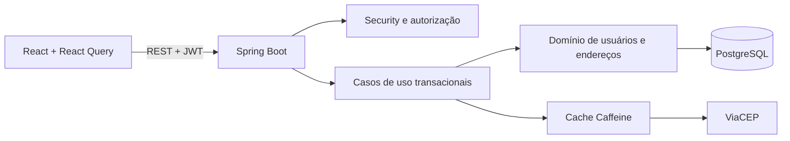

# Solution Address Book

Aplicação full stack para gestão de usuários e múltiplos endereços, desenvolvida para o teste técnico da Solution. A entrega prioriza regras de negócio consistentes, autorização no backend, experiência acessível e execução reproduzível.

[](https://openjdk.org/)
[](https://spring.io/projects/spring-boot)
[](https://react.dev/)
[](https://www.postgresql.org/)
[](https://docs.docker.com/compose/)
[](#testes-e-qualidade)

## Para o avaliador

Suba toda a solução com um comando:

```bash
docker compose up --build
```

Acesse [http://localhost:3000](http://localhost:3000) e use:

- CPF: `529.982.247-25`
- Senha: `Admin@123`

Docker Compose cria PostgreSQL, executa migrações Flyway, compila backend e frontend, roda testes do backend durante o build e aguarda healthchecks antes de liberar a interface.

> Credenciais e segredos presentes no Compose existem somente para avaliação local. Em produção, use variáveis documentadas em [.env.example](.env.example).

## Entrega em resumo

| Área | Implementação |
|---|---|
| Autenticação | Login por CPF, senha BCrypt e JWT stateless |
| Autorização | Perfis `ADMIN` e `USER`, ownership validado no serviço e proteção contra IDOR |
| Usuários | Cadastro, consulta, edição, nível de acesso, foto e desativação reversível |
| Endereços | CRUD completo, endereço principal e promoção automática |
| CEP | Consulta ViaCEP validada também no backend, com timeout e cache Caffeine |
| Dados | PostgreSQL 17, Flyway, UUID, constraints e índice único parcial |
| Interface | React 19, TypeScript, React Query, shadcn/ui, Radix, CVA e layout responsivo |
| Qualidade | 23 testes backend, 6 frontend e 2 jornadas E2E com Playwright |
| Operação | Imagens Docker multi-stage, usuário não-root, healthchecks e CI |

## Requisitos e regras de negócio

- Administrador cria, lista, visualiza e edita usuários.
- Administrador altera nível de acesso e desativa ou reativa contas.
- Usuário comum acessa e edita somente o próprio cadastro.
- Usuário comum nunca altera o próprio nível de acesso.
- Cada usuário envia, substitui ou remove somente a própria foto.
- Administrador pode visualizar, mas não modificar, foto de outro usuário.
- Conta inativa não autentica e permanece disponível para auditoria e reativação.
- CPF é normalizado, validado pelos dígitos verificadores e protegido por unicidade.
- Primeiro endereço cadastrado torna-se principal automaticamente.
- Exclusão do endereço principal promove o endereço mais antigo restante.
- Apenas um endereço principal pode existir por usuário, inclusive sob concorrência.
- CEP informado pelo cliente é consultado novamente pela API antes da persistência.

## Arquitetura

Foi adotado monólito modular com frontend separado. Para o escopo proposto, essa escolha mantém implantação simples e transações fortes sem criar custo prematuro de sistemas distribuídos.



### Limites do backend

- `api`: controllers, DTOs, validação de entrada e contrato de erros.
- `application`: casos de uso, autorização contextual e transações.
- `domain`: entidades, invariantes e contratos de repositório.
- `security`: autenticação stateless e identidade do ator.
- `infrastructure`: integrações externas.
- `config`: segurança, cache, CORS e bootstrap administrativo.

Documentação complementar:

- [Arquitetura e system design](docs/ARCHITECTURE.md)
- [Decisões técnicas](docs/DECISIONS.md)

## Decisões de engenharia

### Consistência do endereço principal

Trocas de endereço principal usam lock pessimista por usuário e transação única. Um índice parcial `UNIQUE (user_id) WHERE is_primary = TRUE` mantém regra como invariante final do banco, protegendo também cenários concorrentes.

### Segurança por padrão

- Controllers recebem identidade autenticada; decisões não dependem da interface.
- Checagem `actor.id == resource.userId` bloqueia acesso horizontal e IDOR.
- Operações administrativas exigem papel `ADMIN` no backend.
- Senhas nunca aparecem em DTOs, respostas ou logs.
- Fotos têm assinatura binária validada, limite de 2 MB e formatos PNG/JPEG.
- Upload e remoção de foto exigem propriedade do perfil, até para administradores.
- CORS, credenciais do banco e segredo JWT são configuráveis por ambiente.
- Container Java executa com usuário sem privilégios.

### Integração ViaCEP

Frontend consulta CEP para resposta rápida; backend consulta novamente antes de gravar. Falhas externas viram erros estáveis, timeouts evitam bloqueio prolongado e cache local de 24 horas reduz chamadas repetidas.

### Fotos sem penalizar listagens

Conteúdo binário fica em tabela separada. Usuário mantém somente metadado de versão, usado para invalidar cache do avatar. Assim, listagens não carregam Base64 nem blobs desnecessários.

## Matriz de acesso

| Operação | Admin | Usuário comum |
|---|:---:|:---:|
| Criar e listar usuários | Sim | Não |
| Visualizar e editar outro usuário | Sim | Não |
| Editar próprio cadastro | Sim | Sim |
| Alterar nível de acesso | Sim | Não |
| Desativar ou reativar conta | Sim | Não |
| Visualizar foto acessível | Sim | Própria |
| Alterar ou remover foto | Própria | Própria |
| Gerenciar endereços acessíveis | Sim | Próprios |

## Stack

### Backend

- Java 21 e Spring Boot 3.5.5
- Spring Web, Security, Validation e Data JPA
- PostgreSQL 17 e Flyway
- JWT com JJWT e senha com BCrypt
- Caffeine Cache e Spring Actuator
- JUnit 5, AssertJ, Mockito e H2 para testes

### Frontend

- React 19, TypeScript 5.8 e Vite 7
- TanStack React Query e Axios
- shadcn/ui no estilo `new-york`, Radix UI e CVA
- Tailwind CSS 4, Lucide Icons e tokens da marca Solution
- Vitest e Playwright

## Estrutura do repositório

```text
.
├── backend/
│   ├── src/main/java/.../api
│   ├── src/main/java/.../application
│   ├── src/main/java/.../domain
│   ├── src/main/java/.../security
│   └── src/main/resources/db/migration
├── frontend/
│   ├── e2e/
│   └── src/
│       ├── auth
│       ├── components
│       ├── features
│       └── pages
├── docs/
├── .github/workflows/
└── docker-compose.yml
```

## API principal

| Método | Rota | Acesso |
|---|---|---|
| `POST` | `/api/auth/login` | Público |
| `POST` | `/api/users` | Admin |
| `GET` | `/api/users` | Admin |
| `GET` | `/api/users/me` | Autenticado |
| `GET` | `/api/users/{id}` | Admin ou proprietário |
| `PUT` | `/api/users/{id}` | Admin ou proprietário; papel somente admin |
| `PATCH` | `/api/users/{id}/status` | Admin |
| `GET` | `/api/users/{id}/photo` | Admin ou proprietário |
| `PUT` | `/api/users/{id}/photo` | Proprietário |
| `DELETE` | `/api/users/{id}/photo` | Proprietário |
| `GET` | `/api/postal-codes/{cep}` | Autenticado |
| `POST` | `/api/users/{id}/addresses` | Admin ou proprietário |
| `PUT` | `/api/users/{id}/addresses/{addressId}` | Admin ou proprietário |
| `PATCH` | `/api/users/{id}/addresses/{addressId}/primary` | Admin ou proprietário |
| `DELETE` | `/api/users/{id}/addresses/{addressId}` | Admin ou proprietário |

Erros seguem contrato previsível:

```json
{
  "timestamp": "2026-09-12T20:00:00Z",
  "status": 422,
  "code": "INVALID_CPF",
  "message": "CPF invalido.",
  "fields": null
}
```

## Testes e qualidade

Última validação local:

| Suíte | Resultado | Cobertura funcional |
|---|---:|---|
| Backend | 23 aprovados | CPF, autenticação, usuários, autorização, status, fotos e endereços |
| Frontend | 6 aprovados | Regras e utilitários de CPF |
| E2E | 2 aprovados | Login, rotas, usuário, papéis, fotos, status e CRUD de endereço |

```bash
# Backend
cd backend
mvn test

# Frontend
cd frontend
npm ci
npm test
npm run build

# E2E: aplicação Docker deve estar ativa
npm run test:e2e
```

Pipeline em `.github/workflows/ci.yml` repete build e testes em cada push ou pull request.

## Desenvolvimento sem Docker

Requisitos: Java 21, Maven, Node.js 22 e PostgreSQL.

```bash
# API
cd backend
mvn spring-boot:run

# Interface, em outro terminal
cd frontend
npm install
npm run dev
```

Frontend abre em `http://localhost:5173` e encaminha `/api` para `http://localhost:8080`.

## GitHub Pages

Workflow `pages.yml` prepara frontend para `https://<usuario>.github.io/<repositorio>/`, usando roteamento por hash para suportar SPA. Defina variável de repositório `VITE_API_URL` com URL HTTPS pública da API.

GitHub Pages hospeda somente arquivos estáticos. Backend Spring Boot e PostgreSQL precisam ser publicados em serviço compatível com containers; sem `VITE_API_URL`, interface é publicada, mas autenticação remota não funciona.

## Variáveis de ambiente

| Variável | Finalidade |
|---|---|
| `POSTGRES_DB` | Nome do banco |
| `POSTGRES_USER` | Usuário do banco |
| `POSTGRES_PASSWORD` | Senha do banco |
| `JWT_SECRET` | Chave de assinatura JWT |
| `ADMIN_CPF` | CPF do administrador inicial |
| `ADMIN_PASSWORD` | Senha do administrador inicial |
| `APP_CORS_ALLOWED_ORIGINS` | Origens aceitas pela API |
| `VITE_API_URL` | URL pública da API usada pelo frontend |

## Identidade visual

Logo e paleta pública da [Solution](https://www.solutionsa.com.br/) foram aplicadas com vermelho `#f44336`, preto `#0a0a0a`, branco e tons neutros. Componentes usam tokens compartilhados, estados consistentes, foco visível e comportamento responsivo.

## Evoluções possíveis

- Testcontainers para validar PostgreSQL e Flyway em integração.
- WireMock para contrato e cenários de falha do ViaCEP.
- Refresh token rotacionado e revogação de sessão.
- Rate limiting no login e na consulta de CEP.
- Redis quando houver múltiplas réplicas.
- Paginação e busca indexada para maior volume.
- Métricas, tracing distribuído e logs estruturados.

---

Projeto preparado com foco em clareza, segurança, consistência transacional e facilidade de avaliação.
