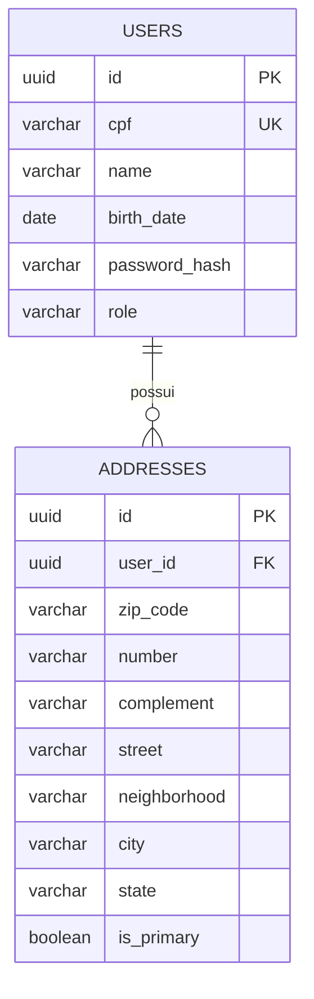

# Arquitetura e system design

## Contexto

Sistema de gestão de usuários e seus endereços. Volume esperado para o desafio é baixo a moderado; consistência e controle de acesso são mais importantes que distribuição prematura.

## Escolha estrutural

Monólito modular com frontend separado. Backend mantém limites por pacote e casos de uso; pode virar serviços independentes quando métricas indicarem necessidade.

### Responsabilidades

1. React controla experiência, cache de servidor e feedback de formulário.
2. API autentica, autoriza e valida todos os dados novamente.
3. Casos de uso demarcam transações e regras de negócio.
4. PostgreSQL garante unicidade e integridade referencial.
5. ViaCEP é dependência externa protegida por timeout, mapeamento de falha e cache.

## Modelo de dados

Índice parcial `UNIQUE (user_id) WHERE is_primary = TRUE` transforma regra crítica em invariante do banco.

## Concorrência do endereço principal

Operações que podem trocar principal:

1. bloqueiam a linha do usuário e carregam endereços com `PESSIMISTIC_WRITE`;
2. desmarcam o principal atual;
3. executam `flush` antes da promoção;
4. promovem o novo principal;
5. confirmam tudo na mesma transação.

O lock no usuário também cobre o caso de primeiro endereço, quando ainda não existe linha de endereço para bloquear. Isso serializa mudanças concorrentes por usuário e trabalha junto do índice único como última barreira.

## Segurança

- Autenticação: CPF normalizado + BCrypt + JWT HMAC.
- Autorização: papel para ações administrativas e comparação `actor.id == resource.userId` para recursos próprios.
- Proteção contra IDOR: regra fica no serviço, não só na rota ou interface.
- Senha: nunca aparece em resposta ou log.
- CORS: origens configuráveis.
- Segredos: variáveis de ambiente; valores do Compose servem somente para desenvolvimento.
- Container: processo Java executado por usuário sem privilégios.

## Resiliência

- Timeouts curtos na integração ViaCEP.
- Erros externos viram `502` com código estável.
- CEP inexistente vira `404`; formato inválido vira `422`.
- Cache Caffeine: até 10 mil CEPs, expiração em 24 horas.
- Healthcheck do backend impede frontend iniciar antes da API saudável.

## Escalabilidade

API não mantém sessão em memória e aceita múltiplas réplicas. Próximos passos para carga maior:

- Redis para cache compartilhado de CEP.
- Rate limiting no gateway, especialmente login e consulta de CEP.
- Paginação e busca indexada de usuários.
- Observabilidade com métricas, tracing e logs estruturados.
- Pool de conexões dimensionado por réplicas e capacidade do PostgreSQL.

## Trade-offs conscientes

- Sem microserviços: domínio pequeno e transacional; distribuição elevaria complexidade sem benefício atual.
- Cache local: simples e suficiente para uma instância; Redis só quando houver múltiplas réplicas.
- JWT sem refresh token: reduz superfície do desafio; produção pode usar access token curto + refresh token rotacionado.
- Seed de admin: facilita avaliação; produção deve usar provisioning seguro e senha temporária.

## Testes recomendados para evolução

- Integração com Testcontainers/PostgreSQL para validar índice parcial e Flyway.
- Testes de autorização para todos os endpoints com admin, dono e terceiro.
- Contract test da ViaCEP com WireMock.
- E2E com Playwright cobrindo login, usuário, endereço e promoção de principal.
- Teste concorrente com duas promoções simultâneas.
